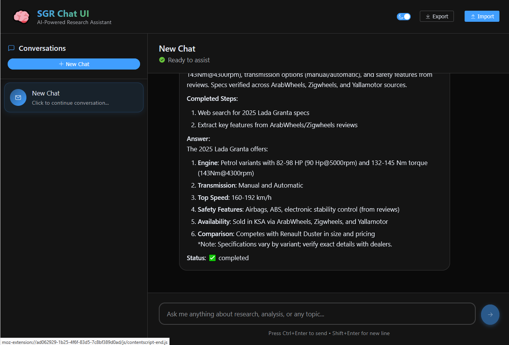

# SGR Deep Research Frontend

Unofficial minimal chat UI built with Vue 3 + Vite and Element Plus, designed as an OpenAI-compatible streaming client for [SGR Deep Research](https://github.com/vamplabAI/sgr-deep-research).


## Features

- Chat layout: left sidebar with chats, main chat view on the right
- Element Plus via small wrapper components (easy to swap UI library)
- IndexedDB persistence: chats and messages stored locally
- Streaming (SSE-like) client: renders assistant output as chunks arrive
- Clarification handling: detects `<think>...</think>`, shows a separate numbered "Thinking" thread line-by-line
- Light/Dark theme with a toggle (persists in localStorage)
- Import/Export all data to JSON (migrate across browsers)

## Requirements

- Node.js 18+
- Running SGR Deep Research API (default `http://localhost:8010`)

## Quick Start

```bash
npm install
cp env.example .env  # or set VITE_API_BASE in your environment
npm run dev
```

Then open the printed local URL (default http://localhost:5173). During development, the dev server proxies requests to `http://localhost:8010` for `/v1`, `/agents`, and `/health`.

## Configuration

- Environment variables (Vite):
  - `VITE_API_BASE` – base URL of SGR Deep Research API. Leave empty to use the dev proxy (recommended for local dev). Set to a full URL for direct calls in production.

The client calls `POST {VITE_API_BASE}/v1/chat/completions` with an OpenAI-compatible body and expects streaming response lines in the form `data: {...}` and a final `data: [DONE]`.

## How Streaming Works

- On send: creates a placeholder assistant message, then appends incoming text chunks
- Parses headers: `X-Agent-ID` is saved to the current chat for follow-up clarifications
- Clarifications: when `<think>` appears, the content is streamed into a separate `thinking` message; each non-empty line is numbered as it arrives; after `</think>` rendering returns to the assistant message
- Errors: network and API errors are shown in UI and appended to the message

## UI Architecture

- `src/ui/*` – thin wrappers over Element Plus (`UiButton`, `UiInput`, `UiTextarea`, `UiCard`, `UiScrollbar`, `UiIcon`, `UiSwitch`, `UiDialog`, `UiTag`, `message`)
- `src/components/*` – chat layout (`ChatList`, `ChatView`, `ChatMessageItem`)
- `src/state/*` – simple app state (chats/messages, theme)
- `src/db/indexedDb.ts` – IndexedDB helpers (chats, messages, import/export)
- `src/api/openaiClient.ts` – OpenAI official library client with SSE support
- `src/config.ts` – small runtime config (`API_BASE`, `DEFAULT_MODEL`)

## Internationalization

Strings are minimal and currently in English. The UI wrappers allow future migration to any i18n stack (e.g., `vue-i18n` or gettext tooling). Suggested approach: introduce a tiny `t(key)` layer and replace visible strings incrementally.

## Scripts

- `npm run dev` – start dev server
- `npm run build` – build for production
- `npm run preview` – preview production build

## License

MIT. See `LICENSE`.


